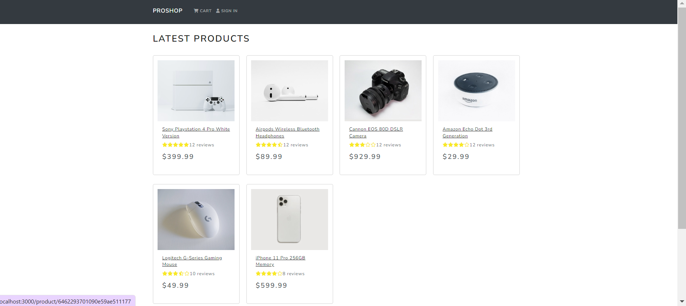

# proshop

## Disclaimer

This project is created as part of my learning process, and I am coding along with a tutorial or educational resource. The code implementation and structure in this repository may be heavily influenced or based on the tutorial content, and I do not claim ownership or originality of the code.

## Acknowledgments

I would like to acknowledge and give credit to the original source of the tutorial or educational resource that I am following. The guidance and instructions provided in the tutorial have been instrumental in helping me learn and improve my coding skills. I encourage you to check out the original resource for more in-depth explanations and examples.
[Brad Traversy]
[https://codeyourfuture.udemy.com/course/mern-ecommerce/learn/lecture/22494380#questions]

- Technologies Used:
  - React Redux --
  - MongoDB --
  - Postman
  - Bcrypt

During the development of this project, I faced several bugs and issues that arose from updates in the technologies used. React Router Dom introduced changes in the hooks compared to those demonstrated in the original video/tutorial.

To address these issues, I had to use:

Debugging Tools: I utilized various debugging tools available in the development environment to identify the root causes of the bugs. This included using browser developer tools, logging relevant data to the console.
Error Messages: I paid close attention to the error messages generated by the browser or development tools. These error messages often provided valuable insights into the specific issues and guided me towards potential solutions